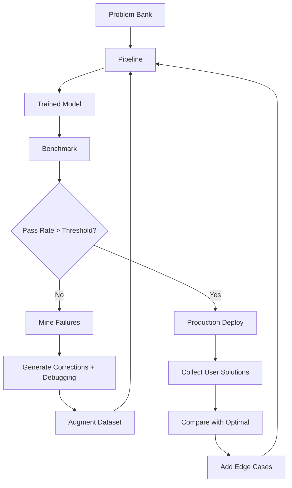

# Competitive Programming Training Strategy

## Overview
Optimized fine-tuning strategy for CP-capable AI chatbot covering LeetCode, HackerRank, Codeforces, CodeChef, and GeeksForGeeks.

---

## 1. Dataset Mix (Target: 500K Examples)

| Component | Count | Ratio | Source |
|-----------|-------|-------|--------|
| Problem Solving | 200K | 40% | Full solution with code |
| Step-by-Step Explanation | 100K | 20% | Reasoning + approach |
| Debugging | 50K | 10% | Buggy code + fix |
| Complexity Analysis | 40K | 8% | Time/space analysis |
| Edge Cases | 40K | 8% | Boundary condition handling |
| Pattern Classification | 40K | 8% | DSA pattern labeling |
| Multi-Language | 30K | 6% | Same solution in 2+ languages |
| **Total** | **500K** | **100%** | |

---

## 2. Curriculum Phases

### Phase 1: Foundations (Weeks 1-2)
- **Difficulty**: Easy
- **Patterns**: Arrays, Strings, Hash Tables, Math
- **Languages**: Python only
- **Examples**: 50K
- **Focus**: Basic syntax, standard library, simple loops
- **Learning Rate**: 5e-5
- **Batch Size**: 128

### Phase 2: Core DSA (Weeks 3-4)
- **Difficulty**: Easy-Medium
- **Patterns**: Two Pointers, Sliding Window, Binary Search, Sorting, Stack, Queue
- **Languages**: Python + Java
- **Examples**: 100K
- **Focus**: Pattern recognition, algorithm templates
- **Learning Rate**: 3e-5
- **Batch Size**: 64

### Phase 3: Advanced DSA (Weeks 5-6)
- **Difficulty**: Medium
- **Patterns**: Trees, Graphs, DFS, BFS, DP, Backtracking, Greedy
- **Languages**: Python + Java + C++
- **Examples**: 150K
- **Focus**: Multi-step reasoning, optimization
- **Learning Rate**: 2e-5
- **Batch Size**: 48

### Phase 4: Expert (Weeks 7-8)
- **Difficulty**: Medium-Hard
- **Patterns**: Segment Tree, Union Find, Shortest Path, MST, Trie, BIT
- **Languages**: All 4 (Python, Java, C++, JavaScript)
- **Examples**: 120K
- **Focus**: Complex algorithms, formal analysis
- **Learning Rate**: 1e-5
- **Batch Size**: 32

### Phase 5: Hard Problem Mining (Weeks 9-10)
- **Difficulty**: Hard-Expert
- **Patterns**: All (focus on low-acceptance problems)
- **Languages**: All 4
- **Examples**: 80K
- **Focus**: Edge cases, optimization, novel problem solving
- **Learning Rate**: 5e-6
- **Batch Size**: 16

---

## 3. Training Configuration

```yaml
model:
  base: "deepseek-coder-6.7b-instruct"  # or codellama, qwen-coder
  architecture: "decoder-only"
  max_length: 4096

training:
  optimizer: "adamw_torch"
  scheduler: "cosine"
  warmup_ratio: 0.1
  weight_decay: 0.01
  gradient_accumulation: 4
  max_grad_norm: 1.0
  bf16: true
  flash_attention: true
  packing: true

lora:
  r: 32
  alpha: 64
  dropout: 0.1
  target_modules: ["q_proj", "k_proj", "v_proj", "o_proj", "gate_proj", "up_proj", "down_proj"]

evaluation:
  benchmarks:
    - humaneval            # Code generation
    - mbpp                 # Basic programming
    - leetcode_contest     # CP problems
    - codeforces           # CP performance
    - gsm8k                # Math reasoning
    - bbh                  # Multi-step reasoning
  metrics:
    - pass@1
    - pass@10
    - runtime_efficiency
    - code_quality
```

---

## 4. Three-Stage Training Protocol

### Stage 1: SFT (Supervised Fine-Tuning)
```bash
python scripts/train_sft.py \
    --model deepseek-coder-6.7b-instruct \
    --dataset exports/cp_dataset \
    --output-dir models/cp-sft \
    --curriculum progressive \
    --phases 5 \
    --lr 5e-5 \
    --epochs 10
```

### Stage 2: Preference Optimization (DPO)
```bash
python scripts/train_dpo.py \
    --model models/cp-sft \
    --dataset exports/cp_preference \
    --output-dir models/cp-dpo \
    --beta 0.3 \
    --lr 1e-5
```

### Stage 3: Hard-Problem Fine-Tuning
```bash
python scripts/train_hard.py \
    --model models/cp-dpo \
    --dataset exports/cp_dataset/hard_problems.jsonl \
    --output-dir models/cp-final \
    --lr 5e-6 \
    --hard-mining
```

---

## 5. Hard-Problem Curriculum

### Mining Strategy
1. **Acceptance rate** < 35%
2. **Rating** > 1800 (Codeforces) / Hard (LeetCode)
3. **Composite difficulty score** > 0.75
4. **Solution pass rate** < 80% in validation
5. **Multiple DSA patterns** required (≥2)

### Hard Problem Categories
```
Tier 1 (Rating 1800-2100):
- Advanced DP (state compression, digit DP)
- Graph algorithms (max flow, SCC)
- Segment tree with lazy propagation
- Advanced string algorithms (KMP, Z, Manacher)

Tier 2 (Rating 2100-2400):
- Heavy-light decomposition
- Link-cut tree
- Convex hull trick
- Dynamic programming on trees
- Game theory with Grundy numbers

Tier 3 (Rating 2400+):
- Polynomial algorithms (FFT, NTT)
- Advanced geometry
- Randomized algorithms
- Online/streaming algorithms
- Approximate/heuristic solutions
```

### Training Schedule for Hard Problems
```yaml
hard_curriculum:
  phase_1: "Pattern review + basic solution"
  phase_2: "Multi-step reasoning with hints"
  phase_3: "Full solution with optimization"
  phase_4: "Edge case analysis + bug hunting"
  phase_5: "Novel problem (unseen pattern combination)"
```

---

## 6. Evaluation Protocol

```bash
# LeetCode evaluation
python eval/run_leetcode.py --model models/cp-final --problems 100

# Codeforces evaluation
python eval/run_codeforces.py --model models/cp-final --contest recent

# HumanEval + MBPP
python eval/run_code_bench.py --model models/cp-final --benchmarks humaneval,mbpp

# Runtime analysis
python eval/measure_runtime.py --model models/cp-final --problems data/eval/cp_runtime.json
```

### Success Criteria
| Metric | Target |
|--------|--------|
| LeetCode Contest Rating | ≥ 1800 |
| Codeforces Rating | ≥ 1400 |
| HumanEval pass@1 | ≥ 65% |
| MBPP pass@1 | ≥ 70% |
| Solution acceptance | ≥ 85% |
| Runtime efficiency | ≤ 2x optimal |
| Multi-language support | 4 languages |

---

## 7. Iterative Improvement



---

## 8. Prompt Templates for Each Training Mode

### Solve Mode
```
### Instruction
Solve the following competitive programming problem. Provide an optimized solution with complexity analysis.

### Problem
{problem_statement}

Constraints:
{constraints}

### Response
[Step-by-step reasoning → optimized code → complexity analysis]
```

### Debug Mode
```
### Instruction
The following code has a bug. Identify the issue, fix it, and explain your reasoning.

### Problem
{problem_statement}

### Buggy Code
```python
{bad_code}
```

### Response
[Bug analysis → fix → prevention tips]
```

### Analyze Mode
```
### Instruction
Analyze the time and space complexity of this solution. Identify bottlenecks and suggest improvements.

### Solution
```python
{code}
```

### Response
[Complexity breakdown → bottleneck analysis → optimization suggestions]
```
