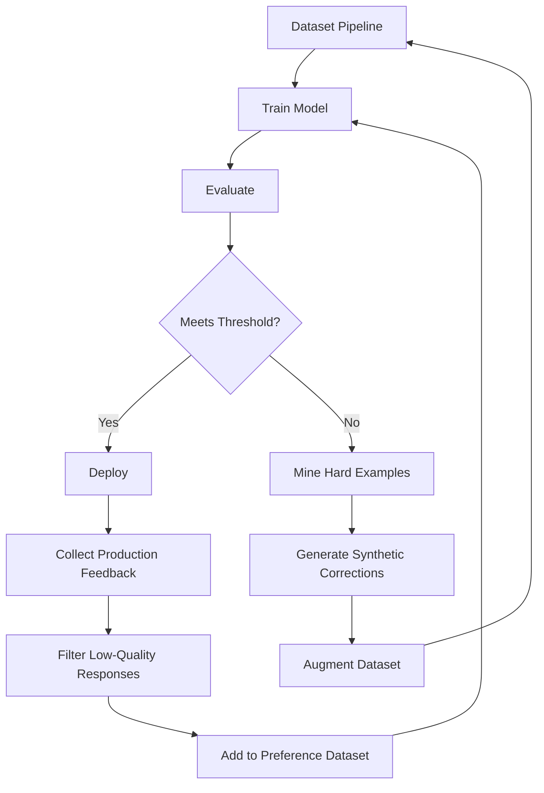

# Fine-Tuning Workflow

## Overview
Production-grade fine-tuning workflow using the curated dataset pipeline.

## 1. Dataset Preparation

```bash
# Build dataset
python scripts/run_pipeline.py \
    --huggingface \
    --output exports/chatbot_dataset \
    --framework transformers

# Generate synthetic data
python scripts/generate_synthetic.py \
    --count 100000 \
    --augment \
    --output exports/synthetic

# Evaluate quality
python scripts/evaluate_quality.py exports/chatbot_dataset --report quality.json
```

## 2. Curriculum-Based Training Schedule

| Phase | Difficulty | Categories | Batch Ratio | Steps |
|-------|-----------|------------|-------------|-------|
| 1: Foundations | 1-2 | conversational, doc, tool | 40% | 1000 |
| 2: Core Skills | 2-3 | DSA, debugging, reasoning | 30% | 2000 |
| 3: Advanced | 3-4 | CP, system design, math | 20% | 2000 |
| 4: Expert | 4-5 | All (hard mining) | 10% | 1500 |
| 5: Alignment | 1-5 | Preference + ranking | - | 500 |

### Phase Configuration
```yaml
phases:
  - name: "foundations"
    difficulty_range: [1, 2]
    categories: [conversational_ai, technical_documentation, tool_usage]
    learning_rate: 5e-5
    batch_size: 128
    steps: 1000
    warmup: 100

  - name: "core_skills"
    difficulty_range: [2, 3]
    categories: [algorithms_dsa, debugging, general_reasoning, file_image_understanding]
    learning_rate: 3e-5
    batch_size: 64
    steps: 2000
    warmup: 200

  - name: "advanced"
    difficulty_range: [3, 4]
    categories: [competitive_programming, system_design, math_logic]
    learning_rate: 2e-5
    batch_size: 32
    steps: 2000
    warmup: 200

  - name: "expert"
    difficulty_range: [4, 5]
    categories: [competitive_programming, math_logic, system_design, debugging]
    learning_rate: 1e-5
    batch_size: 16
    steps: 1500
    warmup: 150

  - name: "alignment"
    categories: all (preference data)
    learning_rate: 1e-5
    batch_size: 32
    steps: 500
    warmup: 50
```

## 3. Training Configuration

### Model Sizes
| Size | Parameters | Batch Size | LR | GPUs | Time |
|------|-----------|-----------|----|------|------|
| Small | 1-3B | 128 | 5e-5 | 1-2 | 1-2 days |
| Medium | 7-13B | 64 | 3e-5 | 4-8 | 3-5 days |
| Large | 34-70B | 16 | 1e-5 | 8-16 | 7-14 days |

### Hyperparameters
```yaml
optimizer: adamw_torch
scheduler: cosine
learning_rate: 3e-5
warmup_ratio: 0.1
weight_decay: 0.01
gradient_accumulation_steps: 4
max_grad_norm: 1.0
bf16: true
flash_attention: true
```

## 4. Three-Stage Training Protocol

### Stage 1: Supervised Fine-Tuning (SFT)
```bash
python -m training.sft \
    --model base_model \
    --dataset exports/chatbot_dataset \
    --output_dir models/sft \
    --num_train_epochs 3 \
    --learning_rate 3e-5 \
    --curriculum linear
```

### Stage 2: Preference Optimization (DPO/ORPO)
```bash
python -m training.dpo \
    --model models/sft \
    --dataset exports/preference_data \
    --output_dir models/dpo \
    --beta 0.1 \
    --learning_rate 1e-5
```

### Stage 3: Hard Example Fine-Tuning
```bash
python -m training.hard_mining \
    --model models/dpo \
    --dataset exports/hard_examples \
    --output_dir models/final \
    --learning_rate 5e-6 \
    --min_quality 0.4 \
    --max_difficulty 5
```

## 5. Evaluation Protocol

```bash
# Evaluate on benchmarks
python evaluation/run_benchmarks.py \
    --model models/final \
    --benchmarks gsm8k,bbh,humaneval,mbpp,ifeval

# Evaluate on custom scenarios
python evaluation/run_scenarios.py \
    --model models/final \
    --scenarios debugging,code_gen,system_design,conversation

# Human evaluation sampling
python evaluation/sample_for_review.py \
    --model models/final \
    --num_samples 500 \
    --output review_samples.json
```

### Key Metrics
- **Coding**: pass@1 on HumanEval, MBPP
- **Reasoning**: accuracy on GSM8K, BBH, MMLU
- **Debugging**: fix rate on SWE-bench
- **System Design**: expert rubric scoring (1-5)
- **Conversation**: MT-Bench score, GPT-4 evaluation
- **Safety**: toxicity, bias, refusal rates

## 6. Iterative Improvement Loop



## 7. Dataset Mix for 1M Training Examples

| Category | Examples | Weight | Source |
|----------|---------|--------|--------|
| Competitive Programming | 150K | 15% | CodeContests, APPS, TACO |
| Algorithms & DSA | 150K | 15% | CodeAlpaca, Magicoder, LeetCode |
| Debugging | 120K | 12% | SWE-bench, MS Debugging, CodeReview |
| System Design | 100K | 10% | Synthetic + curated |
| General Reasoning | 100K | 10% | BBH, GSM8K, ARC |
| Math & Logic | 100K | 10% | MathDataset, MetaMathQA, Numina |
| Conversational | 100K | 10% | UltraChat, OASST1, ShareGPT |
| Technical Docs | 60K | 6% | Doc-Code, Stack Exchange |
| Tool Usage | 60K | 6% | ToolBench, API-Bank |
| File/Image | 60K | 6% | ChartQA, DocVQA, custom |
| **Total** | **1M** | **100%** | |

## 8. Production Best Practices

1. **Data Freshness**: Re-run pipeline monthly with new data sources
2. **Quality Gates**: Block deployment if any benchmark drops >2%
3. **A/B Testing**: Compare new model against production on 10% traffic
4. **Monitoring**: Track response length, refusal rate, toxicity score
5. **Feedback Loop**: Log all user feedback, weekly retrain on corrections
6. **Versioning**: Store dataset snapshots with git-lfs, pin versions in config
7. **Security**: Run PII removal, prompt injection detection before training
8. **Reproducibility**: Seed all RNG, log all configs, freeze dependencies
